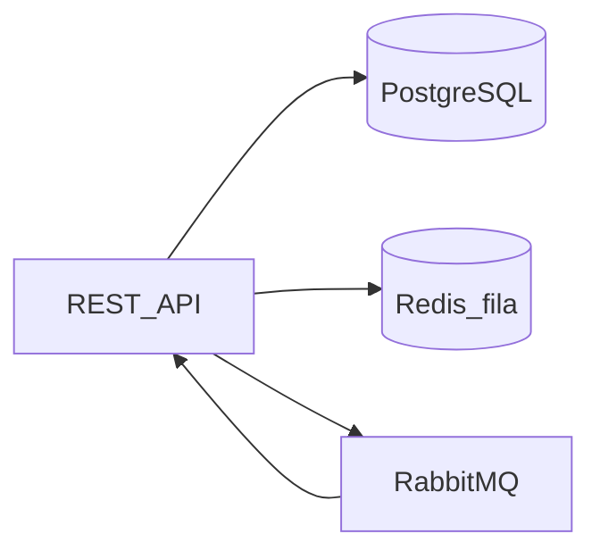

# Arquitetura — Execution Service

## Bounded context

Fila de produção, work orders, diagnóstico e execução simulados para demo.

```mermaid
flowchart LR
  API[REST_API]
  PG[(PostgreSQL)]
  Redis[(Redis_fila)]
  RMQ[RabbitMQ]
  RMQ --> API
  API --> PG
  API --> Redis
  API --> RMQ
```

Ver [saga-events.md](saga-events.md).
